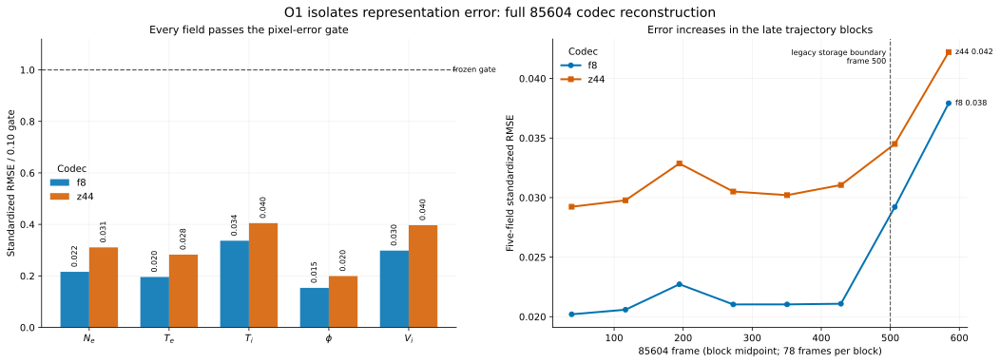
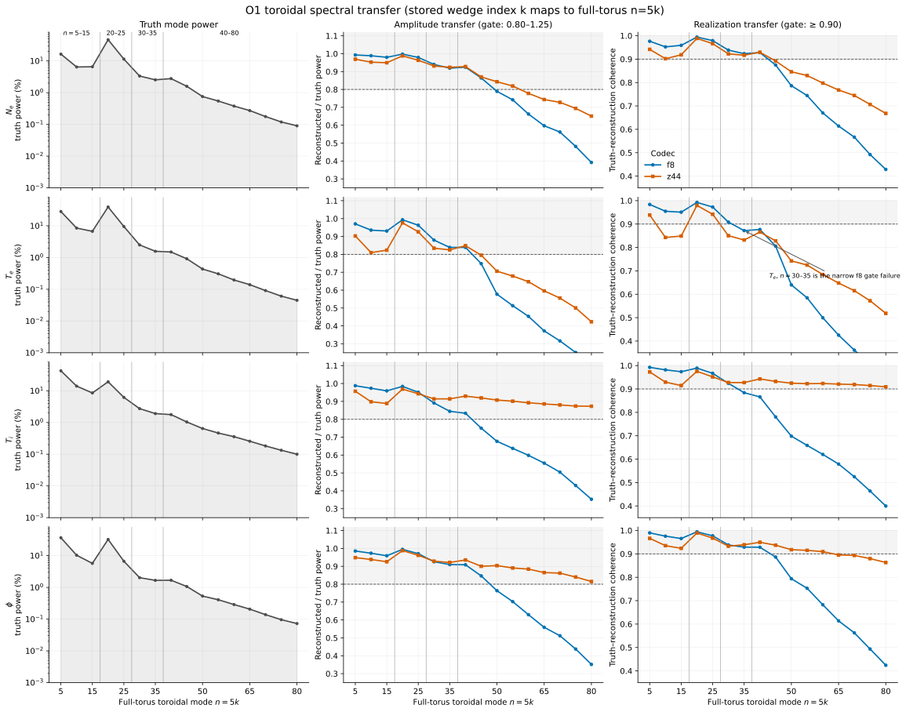
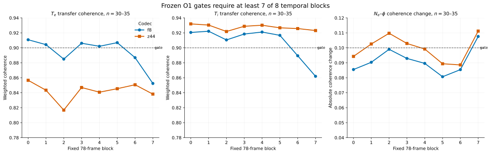
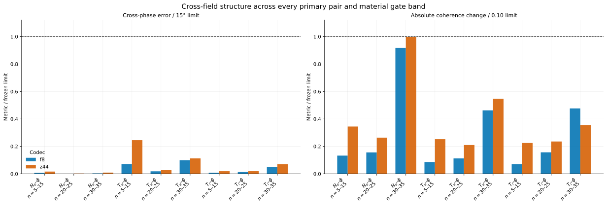

# Phase 2 O1 codec-reconstruction readout

**Status:** complete; both historical codecs fail the frozen preliminary
representation gate

**Evidence job:** `6890650`

**Executed Paper 0 commit:** `2bf810ff226641ac1955367a18bd492ab08c442c`

**Run accessed:** `85604` only, all 624 frames

**Run not accessed:** `85606`

**Full codec acceptance:** blocked pending an authoritative geometry-aware
transport calculation

## Executive conclusion

O1 cleanly isolates field compression from forecasting. Each stored 85604
frame was passed through `decode(encode(x))`; there was no dynamics model,
sampler, observation operator, filter, or future-frame input.

The result is narrower than either “f8 works” or “the codec is broken”:

1. Both checkpoints reproduce all five standardized fields with low pixel
   error and nearly unchanged variance.
2. The historical f8 checkpoint preserves the dominant `n=20--25` band and all
   frozen primary cross-field checks. It misses the preliminary spectral gate
   at the weaker `n=30--35` temperature band, including the required
   block-to-block robustness.
3. The historical z44 checkpoint retains several higher modes better, but has
   worse five-field error, substantially worse `Te` transfer, and unstable
   `Ne-phi` coherence in `n=30--35`. It is not a better all-purpose
   representation.
4. The f8 latent Nyquist index at `k=5` (`n=25`) is not a hard decoded-field
   cutoff. The decoder reconstructs appreciable power and coherence at
   `k=6--7` (`n=30--35`), then degrades gradually at higher modes.
5. O1 does not yet establish particle- or heat-transport fidelity. Under the
   predeclared decision rule, new forecast training remains paused while the
   representation and authoritative transport gate are resolved.

The practical decision is to retain f8 as the stronger historical reference,
not to adopt z44. If a codec repair is needed after the transport calculation,
the next causal experiment is a matched from-scratch capacity comparison with
the same data, loss, and budget—not another unmatched fine-tune.

## What was executed

The Rocky 9 job verified the data, checkpoint, configuration, and predecessor
source hashes before inference. It used deterministic float32 CUDA evaluation
on an NVIDIA H100 with TF32 disabled and seed zero. The two codecs received the
same chronological frames, legacy preprocessing, and no augmentation.

| Item | f8 | z44 |
|---|---:|---:|
| Parameters | 151,319,941 | 115,928,965 |
| Nominal scalar compression | 40x | 10x |
| Codec elapsed time | 31.67 s | 35.60 s |
| Peak CUDA memory | 1.59 GB | 1.45 GB |
| Historical training lineage | 50 epochs from scratch, MAE | 12-epoch z22 continuation, non-strict load, MAE plus increment term |

Because parentage, loss, and budget differ, the result compares these two
specific checkpoints. It does not identify latent toroidal resolution as the
cause of their differences.

## Field reconstruction

The frozen field gate requires RMSE at most `0.10` and variance ratio in
`[0.80, 1.20]` for every field. Both codecs pass it comfortably.

| Field | f8 RMSE | f8 variance ratio | z44 RMSE | z44 variance ratio |
|---|---:|---:|---:|---:|
| `Ne` | 0.02158 | 0.99861 | 0.03106 | 0.99665 |
| `Te` | 0.01957 | 1.00064 | 0.02826 | 1.00055 |
| `Ti` | 0.03365 | 0.99862 | 0.04049 | 0.99717 |
| `phi` | 0.01535 | 1.00102 | 0.01992 | 1.00119 |
| `Vi` | 0.02982 | 1.00126 | 0.03970 | 0.99898 |
| **Five-field aggregate** | **0.02492** | — | **0.03279** | — |

Neither reconstruction produced a non-positive density cell. Potential's
per-frame gauge-fixed RMSE is `0.01534` for f8 and `0.01991` for z44, nearly the
same as the raw standardized values; a constant potential offset is not driving
this result.



The late-block rise is descriptive evidence within the same historically
inspected run. It aligns with the Phase 1 finding that the trajectory changes
over time, but it does not prove that nonstationarity causes the reconstruction
error.

## Toroidal spectral transfer

The stored simulation covers one fifth of the torus, so `zperiod=5` and the
full-torus mode number is

```text
n = 5k.
```

The frozen spectral gate applies to every material band through `k=7`
(`n=35`). It requires reconstructed/truth power in `[0.80, 1.25]`,
truth-to-reconstruction coherence at least `0.90`, and at least seven of eight
temporal blocks passing independently.

The dominant `n=20--25` band is reconstructed well by both codecs:

| Field | Truth power fraction | f8 power ratio | f8 coherence | z44 power ratio | z44 coherence |
|---|---:|---:|---:|---:|---:|
| `Ne` | 57.92% | 0.9939 | 0.9912 | 0.9829 | 0.9840 |
| `Te` | 48.76% | 0.9874 | 0.9886 | 0.9664 | 0.9722 |
| `Ti` | 25.30% | 0.9758 | 0.9836 | 0.9624 | 0.9695 |
| `phi` | 39.06% | 0.9907 | 0.9913 | 0.9833 | 0.9854 |

At `n=30--35`, the truth power is smaller but still above the predeclared 1%
materiality threshold:

| Field | Truth power fraction | f8 power ratio | f8 coherence | f8 passing blocks | z44 power ratio | z44 coherence | z44 passing blocks |
|---|---:|---:|---:|---:|---:|---:|---:|
| `Ne` | 5.86% | 0.9308 | 0.9319 | 8/8 | 0.9281 | 0.9201 | 8/8 |
| `Te` | 4.07% | 0.8639 | **0.8942** | **5/8** | 0.8309 | **0.8431** | **0/8** |
| `Ti` | 4.63% | 0.8719 | 0.9076 | **6/8** | 0.9141 | 0.9274 | 8/8 |
| `phi` | 3.68% | 0.9184 | 0.9339 | 8/8 | 0.9254 | 0.9356 | 8/8 |

Thus f8's spectral failure is specific: the overall `Te` coherence is 0.0058
below the frozen limit, and `Te` plus `Ti` lack the required seven passing
blocks. z44 improves `Ti` and several modes above `n=40`, but its `Te` transfer
is worse at every temporal block in the upper study band.





This resolves the old “f8 cannot contain anything above `n=25`” concern. The
network does emit and partially preserve higher decoded-field modes. Its
transfer degrades continuously rather than terminating at a strict modal
boundary. Whether the remaining loss matters for transport is an empirical
flux question, not something inferable from the latent grid alone.

## Cross-field structure

The frozen cross-field gate evaluates `Ne-phi`, `Te-phi`, and `Ti-phi` in all
material bands through `n=35`. It requires weighted absolute phase error at
most 15 degrees, weighted absolute coherence change at most `0.10`, and at
least seven of eight blocks passing.

All nine f8 pair-band checks pass. For the upper `n=30--35` band:

| Pair | Truth cross-amplitude fraction | f8 phase error | f8 coherence change | f8 passing blocks | z44 phase error | z44 coherence change | z44 passing blocks |
|---|---:|---:|---:|---:|---:|---:|---:|
| `Ne-phi` | 4.79% | 0.050° | 0.0917 | 7/8 | 0.133° | 0.0998 | **4/8** |
| `Te-phi` | 4.28% | 1.492° | 0.0462 | 8/8 | 1.689° | 0.0546 | 8/8 |
| `Ti-phi` | 3.87% | 0.743° | 0.0476 | 8/8 | 1.046° | 0.0355 | 8/8 |

z44's full-record `Ne-phi` upper-band coherence change is just inside the
0.10 limit, but only four temporal blocks pass. The temporal criterion is why
its cross-field gate fails; the full-record average alone would hide that
instability.



Cross-field phase and coherence are necessary checks for nonlinear transport,
but they are not sufficient. Geometry weighting, radial derivatives, field
conventions, and boundary masks still enter the authoritative flux definition.

## Gate accounting

| Codec | Field reconstruction | Spectral transfer | Cross-field structure | Preliminary status | Full transport status |
|---|---|---|---|---|---|
| f8 | pass | **fail** | pass | **fail** | blocked |
| z44 | pass | **fail** | **fail** | **fail** | blocked |

The gate thresholds were frozen before the result was opened. They are
engineering stop/go criteria, not universal plasma-physics tolerances. A miss
by 0.0058 is still a protocol failure, but it should not be rhetorically
inflated into a catastrophic representation collapse.

## Consequences for the Paper 0 program

### What is now established

- The historical f8 representation is not responsible for large pixelwise
  loss; its five-field standardized reconstruction RMSE is 0.02492.
- f8 accurately transfers the dominant `n=20--25` band and preserves the frozen
  primary cross-field phase/coherence checks through `n=35`.
- f8 has a measured, gradual high-mode attenuation and narrowly misses the
  frozen temperature transfer criteria at `n=30--35`.
- The available z44 checkpoint is not a controlled capacity ablation and is not
  a superior replacement for f8.
- Reconstruction quality deteriorates in late 85604 blocks for both codecs,
  reinforcing the need to resolve the Phase 1 temporal-regime question.

### What remains unestablished

- Codec preservation of authoritative particle and heat flux.
- One-step forecast error or state sufficiency for C5 versus an augmented state.
- Autonomous rollout fidelity for any architecture.
- Ensemble calibration of fields, modes, or transport.
- Validity of an emulator ensemble as an assimilation prior.
- Any diagnostic ranking under a validated prior.
- Any result whatsoever on the blinded 85606 simulation.

### Next locked sequence

1. Identify and test the authoritative Hermes/TCV particle- and heat-flux
   definitions, geometry factors, derivatives, and region masks.
2. Add those quantities to O0 synthetic metric oracles.
3. Evaluate truth versus codec reconstruction member-by-member at O1 and close
   the full representation gate.
4. If f8 passes transport despite the narrow spectral miss, document the
   tolerance sensitivity and retain it as the historical baseline while a
   matched repair is evaluated. Do not silently change the frozen result.
5. If f8 fails transport, train matched codecs from scratch on the accepted
   85604 protocol using only allowed field-space training losses; select by the
   already-frozen physics evaluation suite.
6. Only after the representation and temporal-regime gates close, proceed to
   O2 teacher-forced one-step tests, including C5 versus physically justified
   augmented inputs.

No diffusion, FGN, PDE-Refiner, residual generator, or assimilation rerun is
authorized by O1 alone. Those experiments remain downstream of the failure
decomposition.

## Reproducibility record

- Compact tracked metrics:
  `paper0/results/phase2_o1_codec_6890650.json`
- Figure generator: `paper0/tools/plot_codec_oracle.py`
- Full immutable Rusty artifact:
  `/mnt/home/sdelaurentiis/ceph/tcv_diagnostics/paper0/phase2_o1_codec/job_6890650/o1_codec_metrics.json`
- Full artifact SHA-256:
  `d9440ecf7182c434976b67a33118d8c3dcb81b0fcec9a16f89745a5398aa850e`
- O1 protocol: `paper0/protocol/PHASE2_O1_CODEC_PROTOCOL.md`
- Numerical amendment: `paper0/AMENDMENTS.md`, entry `A005`

Regenerate every figure from stored metrics without rerunning inference:

```bash
MPLCONFIGDIR=/tmp/tcv-diagnostics-mpl \
python3 paper0/tools/plot_codec_oracle.py \
  --result paper0/results/phase2_o1_codec_6890650.json \
  --output-dir paper0/figures/phase2_o1
```
