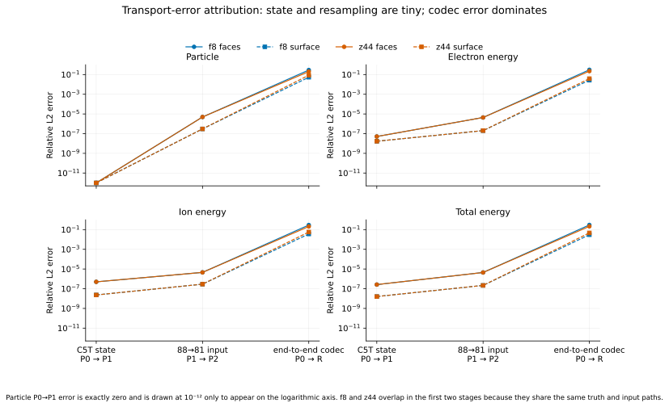
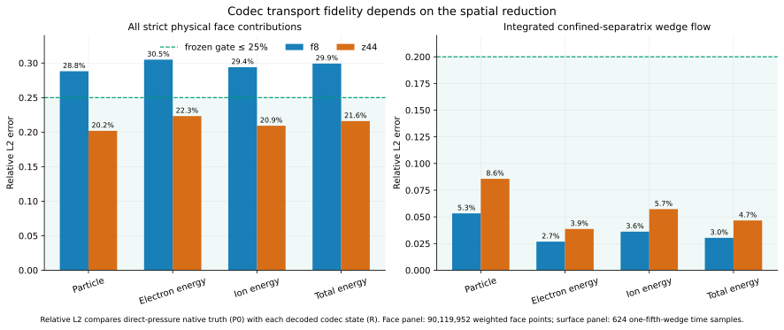
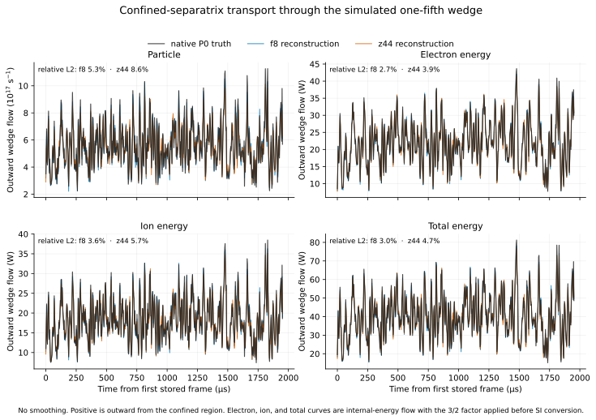

# Phase 2 O1 codec-transport readout

**Status:** complete; the transport extension is informative, but neither
historical codec passes the complete frozen O1 representation gate

**Evidence job:** `6891766`

**Executed Paper 0 commit:**
`47a26e3ad7e7c8c9a216930dbddd3954e1213e60`

**Run accessed:** `85604` only, all 624 frames

**Run not accessed:** `85606`

**Training performed:** none

## Executive conclusion

This experiment answers a narrow upstream question: when an exact 85604 state
is encoded and decoded once, how much of a source-validated, geometry-aware
radial ExB transport diagnostic survives? It contains no forecast, stochastic
sampling, assimilation, or future truth.

The result separates four effects that had previously been tangled together:

1. Legacy and native inputs are aligned to better than `1.6e-7` relative L2
   per frame for every field.
2. The native-81 versus legacy-88 storage/resampling path changes transport by
   less than `5e-6` on strict faces and `3.1e-7` on the integrated separatrix
   series. It is not the material error source.
3. Reconstructing pressure from the historical temperature state changes the
   scored transport by at most `5.1e-7` relative L2. The frozen electron
   identity threshold was `1e-10`, so this is formally a failed gate, but it is
   a floating-point-scale numerical miss rather than a material transport
   discrepancy in this 85604 calculation.
4. Codec reconstruction dominates the error. The f8 codec has roughly
   `29--30%` relative error when every signed face contribution is compared,
   but only `2.7--5.3%` error after integration over the confined separatrix.
   The z44 checkpoint reduces local face error to `20--22%`, while its
   integrated separatrix errors are `3.9--8.6%` and are consistently larger
   than f8's.

This is not a z44 victory. z44 passes the frozen radial-transport subgate, but
its earlier spectral and cross-field O1 gates fail, it produces more
non-positive reconstructed pressure cells, and its training lineage is not
matched to f8. f8 remains the stronger historical reference for the
integrated separatrix quantity, but it fails the frozen local-face and
spectral subgates. Therefore **neither historical codec is accepted for new
Paper 0 dynamics training**.

## What was measured

The accepted native evaluator computes the combined radial ExB face flow
through the simulated one-fifth toroidal wedge (`zperiod=5`, so `n=5k`). For a
state with density `N_e`, pressure `P`, and electrostatic potential `phi`, let
`Q(P, phi)` denote the validated, geometry-aware radial face operator. The
four reported quantities are

\[
F_N = Q(N_e,\phi),
\]

\[
F_{U_e} = \frac{3}{2}Q(P_e,\phi), \qquad
F_{U_i} = \frac{3}{2}Q(P_i,\phi),
\]

\[
F_{U_{\mathrm{total}}} = F_{U_e}+F_{U_i}.
\]

`F_N` is a particle-flow rate after SI conversion. The energy quantities are
radial ExB advective internal-energy flows in watts. They are not yet a claim
about every term in a complete experimental heat-flux balance.

Two spatial reductions answer different questions:

- **Strict faces:** compare each geometry-weighted signed contribution on
  1,783 valid face rows for every toroidal cell and frame, totaling
  90,119,952 points. This tests local transport structure.
- **Confined separatrix:** sum the 16 exact separatrix rows (`x=15 -> 16`,
  `y=8..23`) and all 81 toroidal cells for each frame. This tests the net
  outward transport through that surface in the simulated wedge.

The normalized error shown below is

\[
E_{\mathrm{rel}}
=
\frac{\lVert \widehat F-F\rVert_2}
     {\lVert F\rVert_2}.
\]

No smoothing is used in the plotted 624-frame time series.

## Attribution ladder

The same transport operator is applied to four state paths:

| Path | Definition | Purpose |
|---|---|---|
| `P0` | native-81 `[Ne, Pe, Pi, phi]` | source-faithful reference |
| `P1` | native-81 `[Ne, Ne*Te, Ne*Ti, phi]` | isolates state parameterization |
| `P2` | legacy C5T input downsampled `88 -> 81` | isolates storage/resampling |
| `R` | codec reconstruction downsampled `88 -> 81` | adds codec compression |

The full error ladder shows that the first two transformations are orders of
magnitude smaller than codec reconstruction.



| Quantity | `P0/P1` strict-face | `P0/P1` separatrix | `P1/P2` strict-face | `P1/P2` separatrix |
|---|---:|---:|---:|---:|
| Particle | `0` | `0` | `4.91e-6` | `3.02e-7` |
| Electron internal energy | `5.14e-8` | `1.69e-8` | `4.38e-6` | `2.03e-7` |
| Ion internal energy | `5.02e-7` | `2.33e-8` | `4.57e-6` | `2.91e-7` |
| Total internal energy | `2.64e-7` | `1.61e-8` | `4.48e-6` | `2.18e-7` |

The predeclared C5T identity gate nevertheless records `fail`, solely because
the electron internal-energy threshold was `1e-10`. That result must not be
silently relabeled. Its scientific interpretation is narrower: C5T is not
bitwise source-identical, while its state-path effect on these aggregate
transport scores is numerically negligible. Direct-pressure C5P remains the
cleaner future state definition because it preserves the evolved simulator
variable and avoids making a floor or closure assumption at rare negative
`Pi` cells.

## Codec transport results

The frozen authoritative comparison is `P0` versus `R`. The local-face gate
requires relative L2 at most `25%`; the integrated-separatrix gate requires at
most `20%`, together with separate bias, amplitude, correlation, sign, and
temporal-block checks.



| Codec | Quantity | Strict-face relative L2 | Separatrix relative L2 | Separatrix correlation |
|---|---|---:|---:|---:|
| f8 | Particle | **28.82%** | 5.33% | 0.9829 |
| f8 | Electron internal energy | **30.49%** | 2.68% | 0.9956 |
| f8 | Ion internal energy | **29.40%** | 3.62% | 0.9922 |
| f8 | Total internal energy | **29.92%** | 3.03% | 0.9942 |
| z44 | Particle | 20.19% | 8.57% | 0.9571 |
| z44 | Electron internal energy | 22.32% | 3.87% | 0.9908 |
| z44 | Ion internal energy | 20.92% | 5.72% | 0.9817 |
| z44 | Total internal energy | 21.60% | 4.66% | 0.9868 |

Bold face values exceed the frozen `25%` local threshold. For f8, relative L2
is the only failed strict-face criterion; its RMS ratio, correlation, weighted
sign disagreement, and integrated criteria pass. z44 passes every frozen
codec-only and authoritative radial-transport criterion. Both codecs pass all
four separatrix quantities in all eight fixed 78-frame temporal blocks.

The integrated result can be much better than the local result without a bug.
The separatrix score sums signed contributions over poloidal and toroidal
positions before comparing frames. Spatially alternating reconstruction errors
can cancel in this sum while the dominant coherent net flow remains accurate.
Thus the two scores are complementary:

- local-face fidelity asks whether the spatial transport map is right;
- separatrix fidelity asks whether its signed net integral is right.

f8 better preserves the latter despite losing more local detail. z44 better
preserves the former, but the unmatched checkpoint does not establish that
latent capacity caused the difference.

## Physical-scale separatrix series

The source-faithful 85604 separatrix flow through the simulated one-fifth
wedge has the following full-record statistics:

| Quantity | Truth mean | Truth standard deviation | f8 RMSE | z44 RMSE |
|---|---:|---:|---:|---:|
| Particle | `5.619e17 s^-1` | `1.634e17 s^-1` | `3.118e16 s^-1` | `5.013e16 s^-1` |
| Electron internal energy | `22.065 W` | `6.525 W` | `0.617 W` | `0.889 W` |
| Ion internal energy | `18.439 W` | `5.436 W` | `0.695 W` | `1.100 W` |
| Total internal energy | `40.504 W` | `11.789 W` | `1.280 W` | `1.967 W` |



These curves describe one deterministic codec round trip of the historically
exposed 85604 run. Their apparent tracking does not establish forecast skill,
ensemble spread, calibration, or cross-shot generalization.

## Reconstructed-state validity

Neither codec produces a non-positive density cell. Without post-hoc clipping,
the decoded temperature products do produce rare non-positive pressures:

| Codec | Non-positive `Pe` | Fraction | Non-positive `Pi` | Fraction |
|---|---:|---:|---:|---:|
| f8 | 132 / 103,514,112 | 0.000128% | 1,750 / 103,514,112 | 0.00169% |
| z44 | 8,266 / 103,514,112 | 0.00799% | 40,152 / 103,514,112 | 0.0388% |

This does not dominate the aggregate transport scores, but it is another
reason not to describe z44 as an unqualified representation improvement.

## Complete O1 gate accounting

| Gate | f8 | z44 | Interpretation |
|---|---|---|---|
| Field reconstruction | pass | pass | low standardized pixel error |
| Spectral transfer | **fail** | **fail** | prior job `6890650` |
| Cross-field phase/coherence | pass | **fail** | prior job `6890650` |
| Input alignment/resampling | pass | pass | numerical path is controlled |
| C5T identity threshold | **formal fail** | **formal fail** | shared `5.14e-8` electron miss versus `1e-10` threshold |
| Radial ExB transport | **fail** | pass | f8 local faces exceed `25%` |
| **Complete historical codec acceptance** | **fail** | **fail** | no codec is released for dynamics |

The thresholds were frozen before the run. No threshold has been relaxed or
reinterpreted to turn a failure into a pass.

## What this establishes

- The earlier transport uncertainty is no longer attributable to a wrong
  toroidal period, image-space mask, unvalidated derivative, SI conversion,
  ensemble ordering, or `88 -> 81` resampling path.
- Compression is the dominant O1 transport error source among the tested
  deterministic transformations.
- f8 preserves the integrated confined-separatrix particle and ExB
  internal-energy series surprisingly well across the whole exposed run.
- Local transport maps are a materially stricter representation test than
  their signed surface integrals.
- More latent toroidal cells are not enough to declare a better codec; the z44
  checkpoint trades better local transport for worse integrated transport,
  prior cross-field failure, more invalid pressure cells, and unmatched
  training history.

## What this does not establish

- No one-step or autonomous forecast was evaluated.
- No stochastic ensemble or calibration metric was evaluated.
- No observation operator, EnKF, ETKF, EnKS, or diagnostic ranking was used.
- The metric is radial ExB particle/internal-energy transport, not yet every
  contribution to a complete heat-flux definition.
- No architecture comparison or causal latent-capacity ablation was run.
- No 85606 field was read, and no held-out claim is available.

## Decision and next safe step

The codec-transport oracle closes the missing O1 measurement, but it does not
reopen the learning gate. The remaining upstream blocker is the Phase 1 data
protocol: the only available 85604 trajectory did not pass the prospectively
frozen stationary-split criterion, and the physically sufficient forecast
state is not yet agreed.

The next safe action is therefore to freeze one of two explicit approaches
before training anything:

1. obtain simulator-owner guidance for a defensible statistically steady
   interval and the required evolved state; or
2. define a prospective nonstationary conditional-forecast protocol that
   models the slow background state without using absolute frame identity.

After that decision, any codec repair must be a matched from-scratch
comparison using the same fields, split, loss, budget, and checkpoint rule.
The historical z44 fine-tune cannot serve as that experiment. Only a codec
that passes the complete O1 suite should proceed to O2 one-step dynamics.

## Reproducibility record

- Frozen protocol:
  `paper0/protocol/PHASE2_O1_TRANSPORT_PROTOCOL.md`
- Tracked compact, figure-complete result:
  `paper0/results/phase2_o1_codec_transport_6891766.json`
- Compact-result SHA-256:
  `140bf3faabb0922edd9108af7d3e00e76c71075caa3a43e5c29760cc043b0a23`
- Full immutable Rusty result:
  `/mnt/home/sdelaurentiis/ceph/tcv_diagnostics/paper0/phase2_o1_codec_transport/job_6891766/o1_codec_transport.json`
- Full-result SHA-256:
  `c8434cfea29fb4fb9bfa3f8e7fb455985aed6885b478513b06b8d6d8214e3df1`
- Figure generator:
  `paper0/tools/plot_codec_transport_oracle.py`
- Locked launcher:
  `cluster/phase2_o1_codec_transport.sbatch`

Regenerate all figures from stored metrics without rerunning inference:

```bash
MPLCONFIGDIR=/tmp/tcv-diagnostics-mpl \
python3 paper0/tools/plot_codec_transport_oracle.py \
  --result paper0/results/phase2_o1_codec_transport_6891766.json \
  --output-dir paper0/figures/phase2_o1_transport
```
