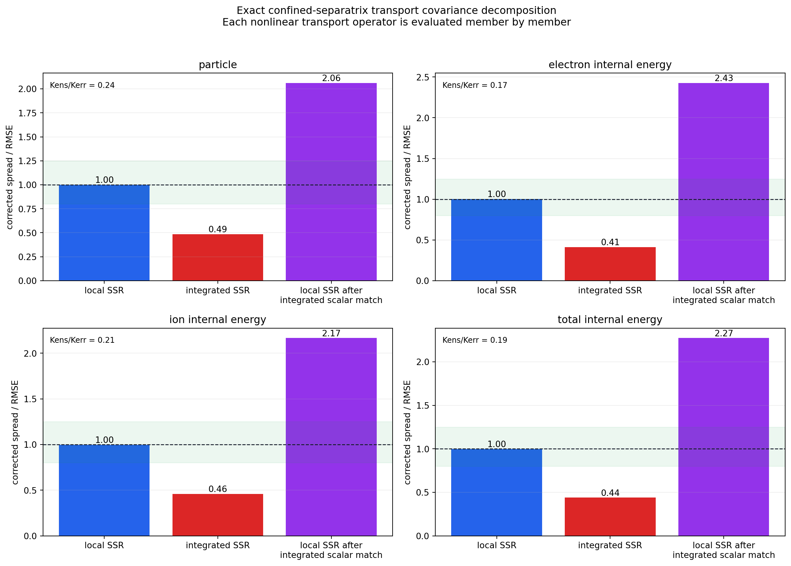
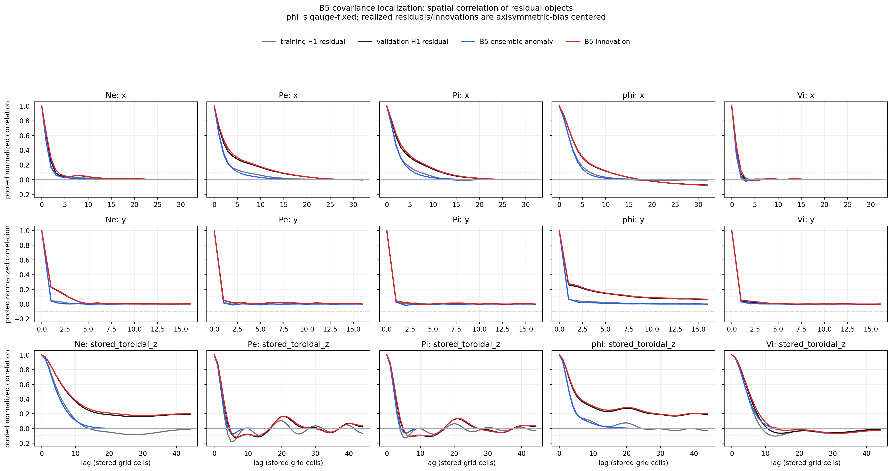
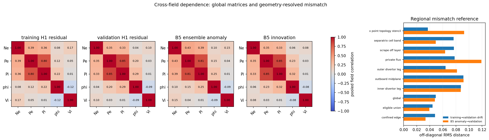
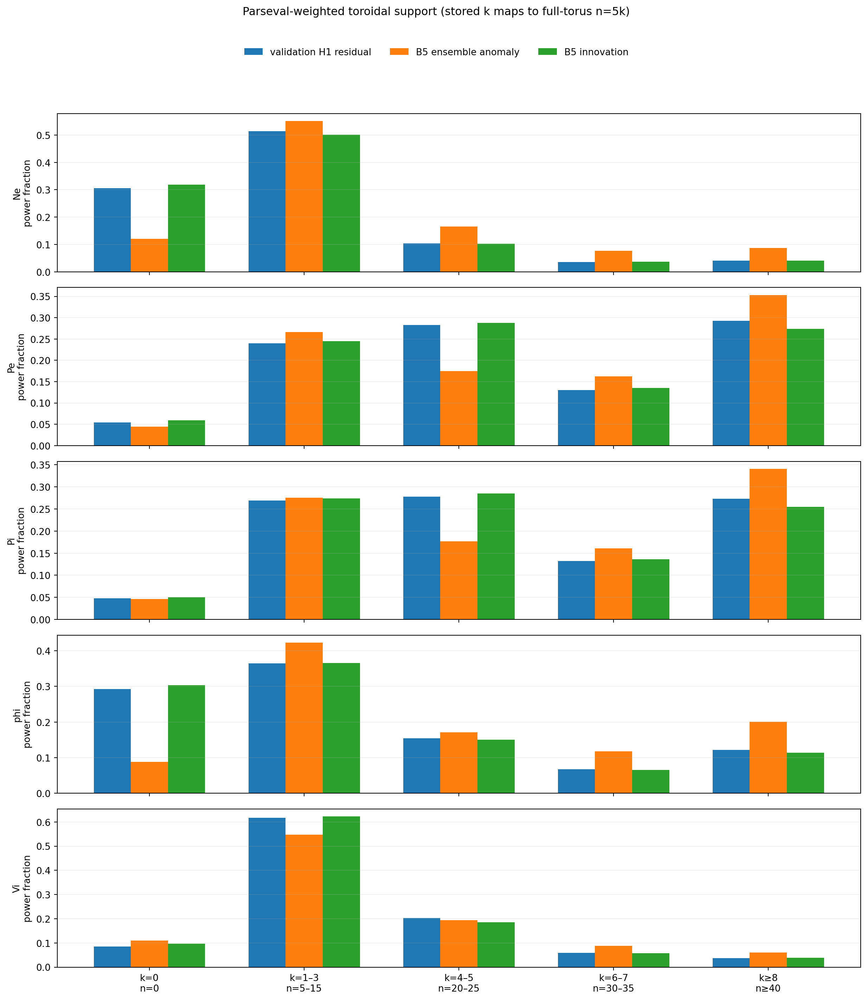
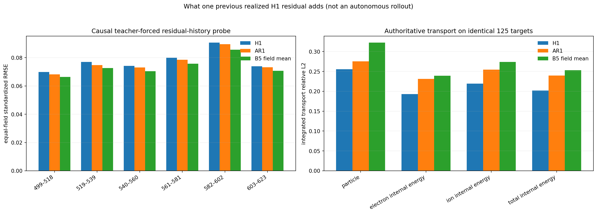
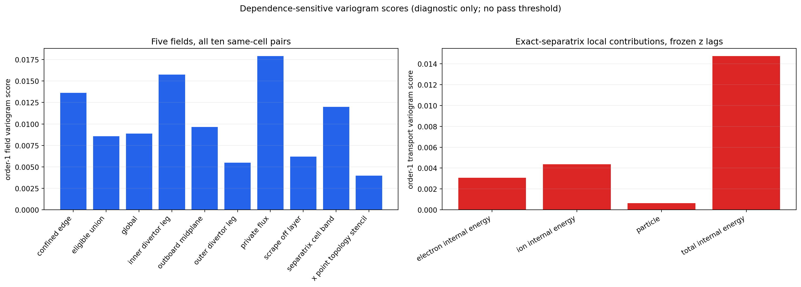

# Phase 3 B5 covariance-localization readout

**Scientific job:** `6901914`

**Execution commit:** `1bb48ac93b5c6cb7ecb1ed357bf11bee8fdaa198`

**Development simulation:** TCV/Hermes 85604 only

**Held-out simulation 85606:** unopened

**Analysis type:** read-only analysis of the frozen B5 M32 one-step forecast;
no checkpoint loading, inference, training, inflation, O3 rollout,
assimilation, or diagnostic ranking

**Decision:** B5 is not predominantly missing scalar noise amplitude. Its
one-step ensemble is covariance-organization limited. Some dependence errors
are systematic beyond the observed training-to-validation drift, but one
realized trajectory cannot identify the complete conditional covariance.
Explicit one-frame residual history does not pass the frozen usefulness
threshold. The forecast acceptance gate remains closed.

## Plain-language conclusion

B5 learned roughly how much uncertainty to place at each local separatrix
face. It did not learn how those local fluctuations should move together.

For all four transport quantities, the local spread--skill ratio is
essentially one. After the same local contributions are summed into one
separatrix transport value, spread--skill falls to `0.413--0.485`. The
ensemble's spatial covariance therefore produces much stronger cancellation
than the realized forecast error does.

This rules out the simplest repair. Multiplying every B5 anomaly by enough to
calibrate integrated transport would raise already calibrated local
spread--skill to `2.06--2.43`. More global noise amplitude would exchange one
failure for another.

The supported diagnosis is:

> B5 has useful local stochastic amplitude, but its spatial and cross-field
> dependence is not organized into the coherent structures required for
> calibrated integrated transport.

This is a one-step result on the development portion of simulation 85604. It
does not establish autonomous-rollout behavior, held-out-shot behavior, or a
general failure of diffusion.

## What was analyzed

For validation target (t), let (x_t) be truth, (mu_t) the frozen H1
forecast, and (X_{t,m}) B5 member (m). The analysis keeps four different
objects separate:

\[
R^{\mathrm{H1}}_t = x_t-\mu_t,
\]

the one realized H1 forecast residual;

\[
R^{\mathrm{B5}}_{t,m} = X_{t,m}-\mu_t,
\]

the residual generated by B5;

\[
A_{t,m} = X_{t,m}-\bar X_t,
\]

the B5 ensemble anomaly; and

\[
D_t = x_t-\bar X_t,
\]

the innovation against the B5 ensemble mean.

The B5 anomaly is the model's conditional variability. The H1 residual and
B5 innovation are single realized errors. They mix physical variability,
forecast error, bias, and within-run distribution shift. Comparing them can
localize an inconsistency, but it cannot recover the true conditional
covariance from one trajectory.

Potential is gauge-fixed for field-covariance diagnostics by subtracting each
sample's spatial mean. Realized residuals and innovations are additionally
centered by the training-only axisymmetric residual bias. Transport is
calculated on the original physical fields because the authoritative radial
(E\times B) operator is invariant to a constant potential offset.

The stored volume is `[Ne, Pe, Pi, phi, Vi] x [64, 32, 88]`. The saved cadence
is `3.131905426352636` microseconds. The simulated toroidal periodicity is
`zperiod=5`, so stored Fourier index (k) maps to full-torus mode number
(n=5k).

## Integrity and provenance

The successful job read the immutable B5 forecast for targets `[498,624)`, 32
members per target, the matching H1 forecasts, 85604 truth, training-only H1
residual references, and authoritative geometry. It verified every locked
input hash and exact target order before producing scientific output.

Key numerical anchors are:

| Integrity check | Recomputed value | Tolerance or reference | Result |
|---|---:|---:|---|
| B5 equal-channel mean RMSE | `0.074907025939` | stored result difference `<2e-6` | pass |
| B5 corrected RMS spread | `0.060052612747` | recomputed directly | pass |
| B5 aggregate spread--skill | `0.801695328226` | stored result difference `<2e-6` | pass |
| maximum anomaly member mean | `2.3842e-7` | `2e-6` | pass |
| maximum separatrix sum closure | `7.7716e-16` | `2e-12` | pass |
| nonlinear transport | member-wise before reduction | required | pass |
| legacy training cross-field matrix | maximum difference `0` | `2e-6` | pass |
| legacy axisymmetric bias | maximum difference `0` | `2e-6` | pass |

Four preceding jobs failed closed while testing an old spatial dot-product
replay check. Instrumentation showed that its result changed with hardware and
reduction order even though all immutable inputs were unchanged. Before any
scientific result, the protocol was correctively amended to retain exact
source and artifact hashes, exact target coverage, exact legacy cross-field
and bias checks, and to compute all new spatial curves with one shared
streaming estimator in the same process. No metric definition, scientific
threshold, or interpretation rule changed.

The authoritative compact result is
[`results/phase3_b5_covariance_localization_6901914.json`](results/phase3_b5_covariance_localization_6901914.json),
SHA-256
`331e7f3ff5d221d0d3720d9112ce90436d8330647501a2268f974867bbc140d2`.
The execution wrapper is
[`results/phase3_b5_covariance_localization_execution_6901914.json`](results/phase3_b5_covariance_localization_execution_6901914.json),
SHA-256
`e11127522821e6837125bae195de424810b0e0e2aee1b2b575ed3fe9ee6e7a41`.

The complete 6.1-MB raw accumulator file remains on Ceph under the immutable
job directory and has SHA-256
`731e86b16b88124998cef8e6776ac9efd3d3f191d224d129312979c0e1c94f17`.

## Frozen interpretation labels

The labels below were evaluated from rules committed before the successful
analysis.

| Label | Supported? | Meaning |
|---|---:|---|
| L1: predominantly amplitude-limited | no | local and integrated uncertainty are not deficient by the same scalar factor |
| L2: covariance-organization limited | **yes** | all four transport quantities have calibrated local amplitude but severe integrated underdispersion and excessive ensemble cancellation |
| L3: field-dependence mismatch beyond within-run drift | **yes** | 11 spatial or regional identities show the same mismatch direction in at least five of six chronological blocks |
| L4: explicit residual-history signal | no | the fixed AR(1) probe improves RMSE by `1.72%`, below the frozen `2%` requirement |
| L5: unresolved by one realized trajectory | **yes** | several dependence identities are not stable beyond the empirical within-run drift reference |

L2 and L5 are not contradictory. L2 identifies a robust failure in integrated
transport covariance. L5 says this one trajectory does not reveal the unique
conditional covariance or prove which architecture will repair it.

## Why transport integration exposes the defect

For a transport quantity, let (q_{t,m,j}) be member (m)'s weighted local
contribution at separatrix sample (j). The integrated value is the sum over
(j). The ensemble variance of that sum contains both local variances and all
off-diagonal covariances:

\[
\operatorname{Var}_m\!\left(\sum_j q_{t,m,j}\right)
=
\sum_j \operatorname{Var}_m(q_{t,m,j})
+
\sum_{i\ne j}\operatorname{Cov}_m(q_{t,m,i},q_{t,m,j}).
\]

B5 gets the first term's scale right. Its off-diagonal terms are too negative
or insufficiently positive, so the sum loses too much variance.

| Transport quantity | Local spread--skill | Integrated spread--skill | Ensemble/error coherence ratio | Scalar factor needed for integrated spread | Local spread--skill after that factor |
|---|---:|---:|---:|---:|---:|
| particle | `1.000` | `0.485` | `0.235` | `2.061` | `2.062` |
| electron internal energy | `1.002` | `0.413` | `0.170` | `2.422` | `2.427` |
| ion internal energy | `0.996` | `0.460` | `0.213` | `2.174` | `2.166` |
| total internal energy | `0.999` | `0.439` | `0.193` | `2.276` | `2.274` |

Every row satisfies the predeclared L2 rule. No row satisfies L1.

This also explains why the earlier lambda or noise-scale experiments were
not enough. They adjusted how much variation the ensemble contains. The
remaining problem is where that variation is placed and how it co-varies
across space and fields.

## Spatial dependence

The spatial autocorrelation plot compares reconstructed training H1
residuals, validation H1 residuals, B5 anomalies, and B5 innovations using one
estimator. The most systematic B5 anomaly mismatches are:

- every field along the stored `y` direction, in all six blocks;
- `Pe`, `Pi`, and `phi` along `x`, in all six blocks;
- `Pi` and `phi` along stored toroidal `z`, in all six blocks.

The plot makes the nature of several failures visible. For example, B5
anomalies decorrelate too quickly for `Pe`, `Pi`, and `phi` along `x`; the
`phi` anomaly also loses the long positive correlation seen in realized
residuals along `y` and stored toroidal `z`. This is not a statement that each
single realized residual curve is the true covariance. The blockwise drift
comparison is what makes the 11 listed identities systematic by the frozen
rule.

## Cross-field dependence and geometry

Global same-cell cross-field matrices look superficially close. For example,
validation H1 residual correlations include `Pe-Pi = 0.848`, while the B5
anomaly has `Pe-Pi = 0.807`. The global B5-to-validation matrix distance is
slightly smaller than the observed training-to-validation drift.

That global summary hides a geometry-specific result. The private-flux region
is the only cross-field identity for which the B5 mismatch exceeds
training-to-validation drift in all six chronological blocks. Other regional
cross-field results are less stable: the X-point stencil does so in four
blocks; the inner divertor, outer divertor, and outboard midplane in three;
global and eligible-union matrices in two.

The defensible statement is therefore not “all cross-field covariance is
wrong.” It is that private-flux cross-field dependence is robustly
misrepresented, while broad global cross-field mismatch is unresolved with
one trajectory.

## Toroidal support

The toroidal figure reports the fraction of each object's power in five
predeclared bands. Because `zperiod=5`, the bands are:

| Stored band | Full-torus modes |
|---|---|
| `k=0` | `n=0` |
| `k=1..3` | `n=5..15` |
| `k=4..5` | `n=20..25` |
| `k=6..7` | `n=30..35` |
| `k>=8` | `n>=40` |

Absolute B5 anomaly power relative to the realized validation H1 residual is
field- and band-dependent:

| Field | `k=0` | `k=1..3` | `k=4..5` | `k=6..7` | `k>=8` |
|---|---:|---:|---:|---:|---:|
| `Ne` | `0.162` | `0.443` | `0.656` | `0.887` | `0.872` |
| `Pe` | `0.456` | `0.622` | `0.346` | `0.696` | `0.676` |
| `Pi` | `0.553` | `0.583` | `0.364` | `0.695` | `0.712` |
| `phi` | `0.142` | `0.543` | `0.519` | `0.818` | `0.770` |
| `Vi` | `0.761` | `0.525` | `0.566` | `0.877` | `0.978` |

B5 is not uniformly short of power. Its stochastic power is particularly
weak in several axisymmetric and low-to-middle bands, while some high bands
approach the realized residual power. Combined with locally correct transport
spread, this supports a structured dependence failure rather than one global
amplitude deficit.

## What one previous residual adds

The history probe is deliberately simple and causal but teacher-forced. It
uses the previous *realized* H1 residual to predict the next residual with one
training-frozen scalar coefficient per field. It is not an autonomous model
and cannot be used without receiving the preceding truth.

The fitted coefficients are negative:

| Field | AR(1) coefficient |
|---|---:|
| `Ne` | `-0.121` |
| `Pe` | `-0.274` |
| `Pi` | `-0.258` |
| `phi` | `-0.247` |
| `Vi` | `-0.304` |

Equal-field standardized RMSE changes from `0.077996` for H1 to `0.076655`
for AR(1), a `1.72%` improvement. It improves all six chronological blocks,
but misses the frozen aggregate requirement of at least `2%` and does not
beat the B5 ensemble-mean RMSE of `0.073978`.

More importantly, the teacher-forced AR(1) correction worsens all four
integrated transport errors relative to H1. Explicit one-frame residual
history is therefore not the next priority on this evidence.

## Spread does not identify hard transport cases

Across the 126 validation targets, B5's predicted global field variance is
associated with squared field error (`Pearson = 0.785`, `Spearman = 0.743`).
The model recognizes some field contexts as harder than others.

The same association is nearly absent for integrated transport:

| Quantity | Pearson | Spearman |
|---|---:|---:|
| particle | `-0.061` | `0.019` |
| electron internal energy | `-0.081` | `0.075` |
| ion internal energy | `0.027` | `0.172` |
| total internal energy | `-0.070` | `0.084` |

These are flow-dependence diagnostics, not proofs of calibration. They show
that B5's ensemble spread is informative about field error but not about when
integrated transport will be wrong.

## Why nonlinear quantities must remain member-wise

The transport of the ensemble-mean fields is not the same as the mean of
member-wise transport because transport is nonlinear and cross-field.

On the identical 125-target history comparison, relative L2 errors from the
B5 *field-mean transport* are `0.323`, `0.239`, `0.274`, and `0.253` for
particle, electron energy, ion energy, and total energy. The mean of the 32
member-wise transport evaluations is substantially better: `0.200`, `0.148`,
`0.182`, and `0.156`.

That difference is why every Paper 0 nonlinear diagnostic must be computed
separately for every member before ensemble reduction.

## Variogram scores

The analysis reports order-one variogram scores for same-cell five-field
pairs and exact-separatrix transport contributions at frozen toroidal lags.
They are dependence-sensitive descriptive metrics. This first localization
has no predeclared pass threshold or competing-model reference for them, so a
small or large bar must not be called a pass or failure.

## What this changes and what remains closed

The result changes the engineering target:

- do not spend the next experiment tuning a scalar lambda, diffusion noise
  scale, or post-hoc inflation;
- do not prioritize one-frame residual history;
- preserve the frozen deterministic H1 mean and test a mechanism that can
  represent coherent global-plus-multiscale residual covariance while
  retaining local variability;
- evaluate that mechanism with the same marginal, spatial, cross-field,
  spectral, and member-wise transport diagnostics;
- keep physics quantities as evaluation metrics, not training losses.

The result does **not** authorize training by itself. A prospective next-arm
protocol must freeze one intervention, matching rules, seed, budget, and
acceptance criteria before implementation. Because L5 is also supported, the
memo must state that one-run development evidence cannot uniquely identify
the target conditional covariance and that an architecture success would
still need the fully frozen 85606 evaluation.

O3 rollout, additional model seeds, assimilation, diagnostic ranking,
steering, and access to 85606 remain closed.

## Reproduction

The six figure pairs are reproduced from the byte-locked compact result,
without training or inference, with:

~~~bash
MPLCONFIGDIR=/tmp/tcv-mplconfig \
PYTHONDONTWRITEBYTECODE=1 PYTHONPATH=src:. \
python paper0/tools/plot_b5_covariance_localization.py \
  --result paper0/results/phase3_b5_covariance_localization_6901914.json \
  --output-dir paper0/figures/phase3_b5_covariance_localization
~~~

The W&B monitoring run is:
<https://wandb.ai/sdelaurentiis123-columbia-university/tcv-diagnostics-paper0/runs/p0b5covloc-6901914-s1701>.
W&B contains compact monitoring summaries only; Ceph and the byte-locked
tracked result are the scientific authorities.
