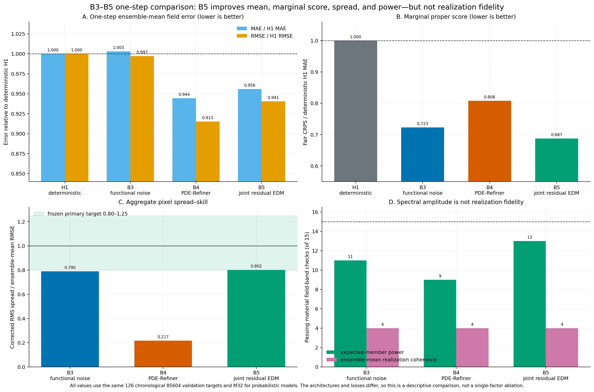
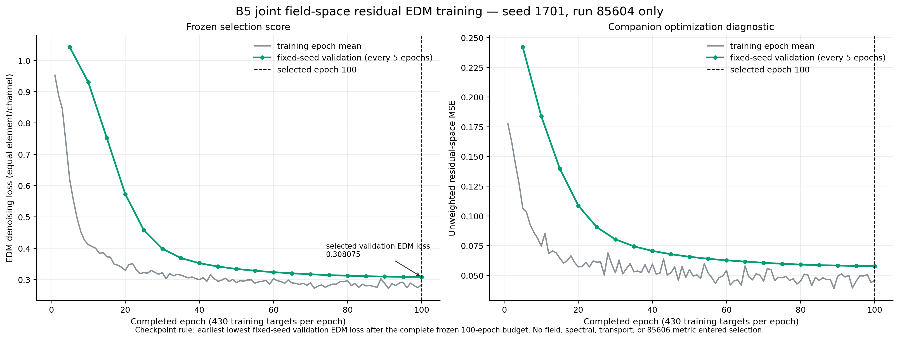
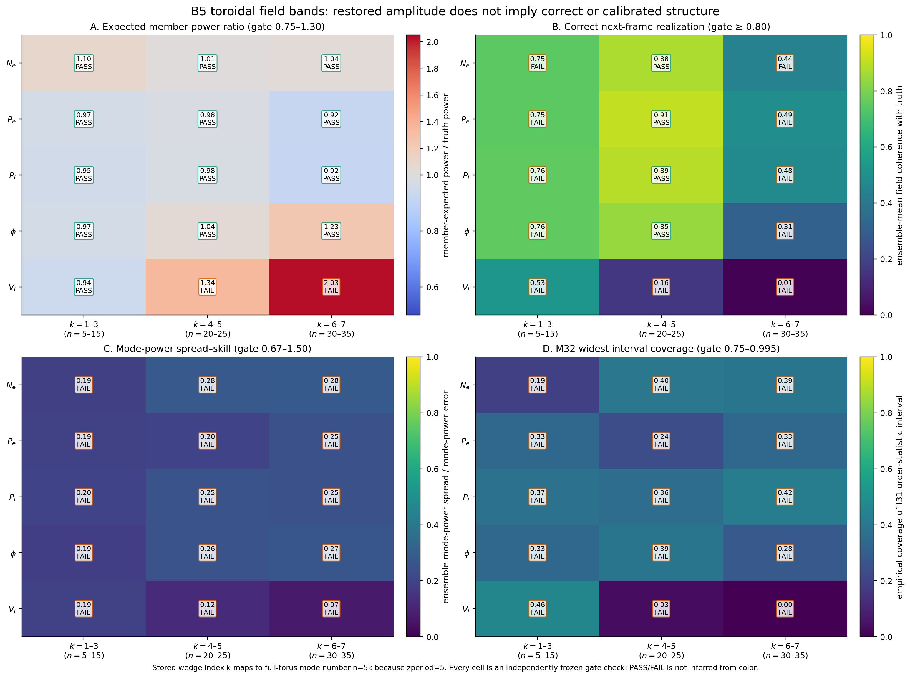
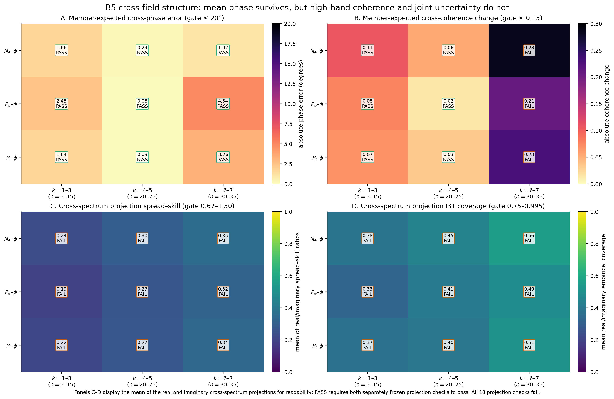
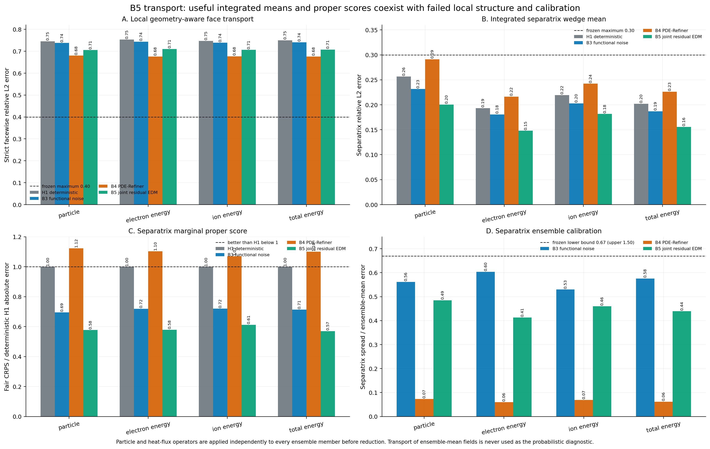
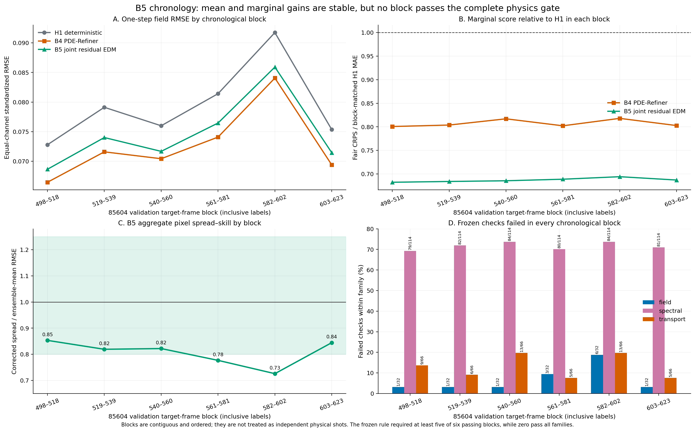

# Phase 3 B5 joint field-residual EDM one-seed readout

**Full training job:** `6901531`

**Bounded evaluator smoke:** `6901582`

**Full scientific evaluation job:** `6901587`

**Frozen gate job:** `6901661`

**Development simulation:** 85604 only

**Held-out simulation 85606:** unopened

**Decision:** B5 fails the frozen one-seed one-step gate. Do not extend it to
O3, train more seeds, assimilate diagnostics, rank diagnostics, or open 85606.
The authorized disposition is
`B5_one_step_gate_failed_localize_without_retuning`.

## Executive conclusion

B5 is the strongest probabilistic one-step model tested so far by marginal
score and expected spectral-power recovery. Relative to its frozen
deterministic H1 mean, the M32 ensemble mean reduces equal-channel MAE by
`4.41%` and RMSE by `5.95%`. Its fair CRPS is `0.687` times the deterministic
H1 MAE, its aggregate pixel spread--skill ratio is `0.802`, and it passes 13
of 15 expected-member power checks.

Those are real gains. They do not solve the scientific problem.

Only 4 of 15 material bands place the structure in the correct next-frame
realization. No material field band passes its mode-power spread--skill or
widest-interval coverage check. All nine mean cross-phase checks pass, but
the three high-band cross-coherence checks fail and none of the 18 real or
imaginary cross-spectrum projections is calibrated. Strict local transport
relative-L2 errors remain near `0.71`, above the frozen `0.40` limit. The
integrated separatrix transport means and fair CRPS values are useful, but all
four transport ensembles are underdispersed.

The most informative localization is this:

> B5 has approximately calibrated uncertainty for pooled local face-flux
> contributions, but not for the spatially integrated separatrix flux.

Strict-face spread--skill is `0.979--0.994` with widest-interval coverage near
`0.942`, whereas separatrix spread--skill is only `0.413--0.485`. Local
marginal variance is therefore not the whole problem. The ensemble fails to
organize that variance into the spatial, modal, and cross-field covariance
needed for coherent transport fluctuations.

The supported conclusion is:

> A joint field-space residual EDM can improve the one-step mean, marginal
> calibration, and spectral amplitude without learning the realization- and
> covariance-resolved distribution required for calibrated nonlinear
> transport.

This is a seed-1701 one-step development result on 85604. It is not an
autonomous-rollout result, a held-out-shot result, or a general negative claim
about residual diffusion.

## What B5 actually is

B5 is not the original LOLA latent diffusion model, not PDE-Refiner, and not a
DCAE residual model. It separates the one-step conditional mean from a joint
field-space stochastic residual.

The frozen deterministic H1 transition first predicts

\[
\mu_{\mathrm{H1}}(x_{t-1}).
\]

The training residual is then

\[
r_t
=
\frac{x_t-\mu_{\mathrm{H1}}(x_{t-1})}{s},
\]

where division by the five training-only residual scales \(s\) is
channelwise. The residual mean is not subtracted. The residual generator
jointly outputs `[Ne, Pe, Pi, phi, Vi]` in full field space. One sampled
forecast member is

\[
\widehat{x}^{(m)}_t
=
\mu_{\mathrm{H1}}(x_{t-1})
+
s\odot r^{(m)}_\theta
\!\left(x_{t-1},\mu_{\mathrm{H1}}(x_{t-1})\right).
\]

The model conditions on ten dynamic channels: the five physically complete
C5P state fields at `t-1` and the five frozen H1 mean fields at `t`. It also
uses two internal poloidal position channels. Absolute time, normalized frame
index, shot label, diagnostic values, future truth, region masks, and an
absolute toroidal coordinate are not inputs.

The residual network is an 11,604,709-parameter 3D U-Net with base width 32,
channel multipliers `[1,2,4,4]`, two residual blocks per resolution, and a
256-feature noise embedding. The two poloidal axes use zero padding and the
toroidal axis uses circular padding. It predicts all five fields jointly.
No DCAE or latent bottleneck is used inside the residual generator.

Training uses the EDM denoising objective with \(\sigma_{\mathrm{data}}=1\):

\[
\mathcal{L}_{\mathrm{EDM}}
=
\mathbb{E}_{r,\sigma,\epsilon}
\left[
\frac{\sigma^2+1}{\sigma^2}
\left\|
D_\theta(r+\sigma\epsilon;\,c,\sigma)-r
\right\|_2^2
\right].
\]

Here \(c\) contains the current state and frozen H1 mean. The training loss
uses equal normalized channel and element weights. It contains no flux,
spectrum, cross-phase, coherence, conservation, PDE residual, blob label, or
other physics-derived quantity.

Scientific sampling uses a deterministic EDM probability-flow ODE with 18
Heun steps and 35 network evaluations per member. The scientific ensemble has
32 independently seeded members. No post-hoc recentering, inflation,
clipping, member rejection, sorting, or calibration is applied.

## Data and selection discipline

The task is one saved-frame step:

~~~text
exact 85604 frame t-1  ->  distribution for exact 85604 frame t
~~~

The saved cadence is `3.131905426352636` microseconds. The stored toroidal
domain has `zperiod=5`, so stored Fourier index `k` maps to full-torus mode
number `n=5k`.

The immutable split is:

| Purpose | Target frames | Count | Access policy |
|---|---:|---:|---|
| training | `[2,432)` | 430 | used for optimization and residual scales |
| guard | `[432,496)` | 64 | unread |
| validation | `[498,624)` | 126 | data-only checkpoint selection and frozen evaluation |
| held-out | simulation 85606 | — | unopened |

Training ran for the complete frozen budget of 100 epochs and 10,800 optimizer
steps, with 43,000 target presentations. AdamW used a cosine learning-rate
schedule from `1e-4` to `1e-6`, gradient clipping at 1, and EMA decay `0.999`.
Validation used four fixed probes for every one of the 126 validation targets
every five completed epochs, in float32 without autocast or TF32. The
checkpoint rule was the earliest lowest fixed-seed validation EDM loss after
the complete budget. Epoch 100 was selected at validation loss
`0.3080749889`; checkpoint reload was bitwise exact.

The validation loss continued decreasing through epoch 100. That says the
frozen denoising objective did not visibly turn upward. It does **not** show
that additional epochs would repair the failed physics distribution. Extending
the budget after seeing this gate would be retuning and is not authorized.

Training W&B:
<https://wandb.ai/sdelaurentiis123-columbia-university/tcv-diagnostics-paper0/runs/p0b5edmfull-6901531-s1701>

Evaluation W&B:
<https://wandb.ai/sdelaurentiis123-columbia-university/tcv-diagnostics-paper0/runs/p0b5eval-6901587-s1701>

## Metric definitions

The following distinctions are essential to interpreting the result.

**Ensemble-mean MAE and RMSE** measure point accuracy of the mean of the 32
forecast members. They do not measure ensemble diversity.

**Fair CRPS** is a finite-ensemble proper score for each scalar forecast. It
rewards both accuracy and useful marginal spread while correcting the usual
finite-member self-distance bias. Lower is better. A good scalar CRPS does not
guarantee correct spatial or cross-field covariance.

**Corrected spread--skill** is corrected ensemble RMS spread divided by the
RMSE of the ensemble mean. A value near one means spread and error have similar
scale. Values far below one indicate underdispersion. The primary field gate
is `[0.80,1.25]`; mode, cross-projection, and separatrix gates use the relaxed
range `[0.67,1.50]`.

**I31 coverage** is the empirical coverage of the widest M32
order-statistic interval, whose finite-ensemble nominal coverage is
`31/33 = 0.9394`. Mode and cross-projection coverage must fall in
`[0.75,0.995]`. Separatrix coverage must be within `0.10` of nominal.

**Expected-member power ratio** compares the mean power of individual members
with truth power. It asks whether generated samples contain the right
amplitude.

**Ensemble-mean realization coherence** compares the ensemble-mean field with
the exact next-frame truth in a material Fourier band. It asks whether the
forecast places structure in the correct realization. A model can have the
right expected power and the wrong realization.

**Cross-phase and cross-coherence** are calculated from the member-wise
complex cross-spectra before ensemble reduction. Cross-phase measures the
relative phase between a density or pressure field and potential;
cross-coherence measures their normalized complex association.

**Strict face transport** evaluates all authoritative geometry-aware radial
face contributions. **Separatrix wedge transport** integrates the confined
separatrix wedge into one time series per target. Every nonlinear flux is
computed independently for every ensemble member before any ensemble
reduction.

## Field accuracy and marginal calibration

| Field | H1 MAE | B5 mean MAE | B5/H1 MAE | B5 fair CRPS | fCRPS/H1 MAE | Spread--skill |
|---|---:|---:|---:|---:|---:|---:|
| `Ne` | 0.04338 | 0.04227 | 0.974 | 0.03080 | 0.710 | 0.701 |
| `Pe` | 0.03269 | 0.03151 | 0.964 | 0.02248 | 0.688 | 0.788 |
| `Pi` | 0.04201 | 0.04088 | 0.973 | 0.02913 | 0.693 | 0.798 |
| `phi` | 0.04560 | 0.04434 | 0.972 | 0.03229 | 0.708 | 0.726 |
| `Vi` | 0.06509 | 0.05968 | 0.917 | 0.04253 | 0.653 | 0.878 |

All five fields improve mean MAE and fair CRPS. Equal-channel aggregates are:

| Model | Mean MAE / H1 | Mean RMSE / H1 | Fair CRPS / H1 MAE | Aggregate spread--skill |
|---|---:|---:|---:|---:|
| H1 deterministic | 1.000 | 1.000 | 1.000 | 0 by construction |
| B3 functional noise | 1.003 | 0.997 | 0.723 | 0.790 |
| B4 PDE-Refiner | 0.944 | 0.915 | 0.808 | 0.217 |
| B5 joint residual EDM | 0.956 | 0.941 | **0.687** | **0.802** |

B5 is the best of these three probabilistic arms by fair CRPS and combines
that score with useful aggregate spread. But only `Vi` passes the strict
per-field spread--skill range. `Pi` and `Pe` narrowly miss the `0.80` lower
bound; `Ne` and `phi` are materially underdispersed. In the private-flux
region, widest-interval coverage fails for `Ne` (`0.718`) and `phi` (`0.666`).
The aggregate value therefore hides field- and region-specific undercoverage.

M16 and M32 are stable: aggregate fair CRPS changes from `0.0314486` to
`0.0314454`, RMSE from `0.07564` to `0.07491`, and spread--skill from `0.8060`
to `0.8017`. The failure is not explained by stopping at 32 members.

## Toroidal spectra: power is not realization

The frozen material bands are `k=1..3` (`n=5..15`), `k=4..5`
(`n=20..25`), and `k=6..7` (`n=30..35`).

B5 passes:

- 13 of 15 expected-member power-ratio checks;
- 4 of 15 ensemble-mean realization-coherence checks;
- 0 of 15 mode-power spread--skill checks;
- 0 of 15 mode-power widest-coverage checks.

The only realization-coherence passes are the middle band for `Ne`, `Pe`,
`Pi`, and `phi`. The high band makes the distinction clear:

| Field | Expected power / truth | Realization coherence | Mode spread--skill | I31 coverage |
|---|---:|---:|---:|---:|
| `Ne`, `k=6..7` | 1.037 | 0.443 | 0.284 | 0.389 |
| `Pe`, `k=6..7` | 0.925 | 0.489 | 0.246 | 0.333 |
| `Pi`, `k=6..7` | 0.916 | 0.476 | 0.249 | 0.421 |
| `phi`, `k=6..7` | 1.232 | 0.309 | 0.268 | 0.278 |
| `Vi`, `k=6..7` | 2.032 | 0.0068 | 0.070 | 0.000 |

For four fields, B5 generates approximately the right high-band amplitude but
not the correct phase-localized realization or a calibrated distribution over
band power. `Vi` is worse: it overproduces middle- and high-band power while
being nearly incoherent with the exact next frame.

## Cross-field structure

All nine member-expected cross-phase errors pass the 20-degree limit. Their
absolute errors range from `0.083` to `4.844` degrees. Six of nine
cross-coherence changes pass the `0.15` limit. All three failures occur in the
highest material band:

| Pair, `k=6..7` | Cross-phase error | Absolute cross-coherence change | Gate |
|---|---:|---:|---|
| `Ne-phi` | 1.019 degrees | 0.283 | coherence fail |
| `Pe-phi` | 4.844 degrees | 0.208 | coherence fail |
| `Pi-phi` | 3.264 degrees | 0.229 | coherence fail |

The ensemble gets the average complex phase relation surprisingly well. That
does not establish a calibrated joint distribution. None of the 18 real or
imaginary cross-spectrum projections passes spread--skill, and none passes
I31 coverage. Projection spread--skill ranges from `0.180` to `0.446`, all
below the `0.67` lower bound.

## Nonlinear transport

| Quantity | Strict L2 | Strict corr. | Separatrix L2 | Separatrix corr. | Sep. fCRPS / H1 error | Sep. spread--skill | Sep. I31 coverage |
|---|---:|---:|---:|---:|---:|---:|---:|
| particle | 0.705 | 0.727 | 0.201 | 0.793 | 0.577 | 0.485 | 0.690 |
| electron internal energy | 0.710 | 0.723 | 0.148 | 0.909 | 0.579 | 0.413 | 0.540 |
| ion internal energy | 0.706 | 0.726 | 0.182 | 0.842 | 0.612 | 0.460 | 0.651 |
| total internal energy | 0.708 | 0.725 | 0.156 | 0.885 | 0.570 | 0.439 | 0.611 |

The strict facewise relative-L2 maximum is `0.40`; all four quantities fail at
about `0.71`. This is modestly better than deterministic H1 (`0.745--0.753`)
and B3 (`0.738--0.744`), but worse than B4 (`0.676--0.680`). The strict
correlations and sign-disagreement values pass, so a temporal and directional
signal remains while local amplitude and structure remain inaccurate.

At the separatrix, all four relative-L2 values pass `0.30`, all normalized
bias and sign checks pass, and three correlations pass `0.80`. Particle
correlation is `0.7928`, narrowly below the threshold. All four fair CRPS
values are substantially better than the deterministic H1 absolute-error
reference.

None of the four separatrix ensembles is calibrated. Spread--skill is only
`0.413--0.485`, and I31 coverage is `0.540--0.690` instead of approximately
`0.939`.

The local-versus-integrated contrast is especially diagnostic. At strict
faces, spread--skill is `0.979--0.994` and I31 coverage is `0.941--0.942`,
nearly nominal. After the same member-wise face contributions are integrated
into separatrix transport, spread collapses relative to error. This is
consistent with incorrect spatial covariance and coherent organization of
the local fluctuations. It is not merely a global noise-amplitude problem.

## Chronological stability

B5 improves ensemble-mean RMSE over H1 in every one of the six contiguous
validation blocks. Its fair-CRPS/H1-MAE ratio stays tightly between `0.682`
and `0.694`. Aggregate pixel spread--skill is acceptable in four blocks and
falls to `0.777` and `0.726` in the fourth and fifth blocks.

The fifth block, targets `582--602`, is the hardest by mean error, but it is
not the sole reason for rejection. Every field, spectral, and transport
family fails in every chronological block. Zero blocks pass all three
families; the frozen requirement is five of six. These blocks are ordered
subsamples of one simulation and are not presented as independent shots.

## Formal gate result

All 120 provenance and integrity checks pass, and every required numerical
metric is finite. The result is a scientific failure, not a job, checksum,
shape, truth-leakage, or W&B failure.

| Family | Overall numerical checks | Failed checks | Passing chronological blocks | Required | Result |
|---|---:|---:|---:|---:|---|
| field | 54 | 4 | 0 | 5 | fail |
| spectral/cross-field | 148 | 83 | 0 | 5 | fail |
| transport | 77 | 7 | 0 | 5 | fail |

The primary overall field failures are insufficient per-field spread--skill
and private-flux undercoverage for `Ne` and `phi`. The spectral family is
dominated by realization, mode-calibration, and cross-projection-calibration
failures. The transport family fails all four strict relative-L2 checks,
particle separatrix correlation, and the required count of calibrated
separatrix quantities.

## What the B3--B5 comparison establishes

The three branches isolate different limitations:

- **B3 functional noise** creates useful marginal field spread and good mean
  cross-field relations, but remains underdispersed in modes and transport.
- **B4 PDE-Refiner** produces the best one-step conditional mean and best
  strict transport error, but its stochastic ensemble nearly collapses.
- **B5 joint residual EDM** produces the best marginal fair CRPS and most
  faithful expected spectral power, but still has the same 4-of-15
  realization-coherence ceiling and lacks coherent transport uncertainty.

This comparison rules out several simple explanations:

1. **The B5 failure is not caused by a residual latent bottleneck.** The
   residual generator is full field-space and uses no DCAE. The H1 mean still
   comes from the frozen C5P pipeline, but the residual has direct field-space
   capacity to repair it.
2. **The failure is not simply zero or globally tiny spread.** Aggregate B5
   spread--skill is `0.802`, and all fields have nonzero spread.
3. **The failure is not simply missing spectral amplitude.** Thirteen of 15
   power checks pass.
4. **The failure is not an M32 Monte Carlo artifact.** M16 and M32 summaries
   are stable.
5. **Low marginal CRPS is insufficient.** B5 has the best fair CRPS but does
   not have a calibrated mode, cross-spectrum, or transport distribution.

What remains is more specific: conditional realization fidelity and the
spatial, modal, temporal, and cross-field covariance of the stochastic
residual.

## What this result does not prove

It does not prove that diffusion is generally unsuitable. It tests one
particular one-frame, one-step, H1-conditioned, compact field-space EDM with a
fixed compute budget and data-only selection rule.

It does not prove why realization coherence remains at 4 of 15. Plausible
hypotheses include insufficient temporal context, an overly restrictive
frozen H1 mean/residual decomposition, insufficient model capacity or
training, or a denoising objective that fits marginal residual density without
the required coherent conditional covariance. The present experiment does
not distinguish those causes.

It does not establish autonomous stability. O4 was never run, and the frozen
gate forbids writing or launching O3 after this failure.

It says nothing about 85606 because 85606 remains unopened.

## Authorized next step

Do not continue B5 training or adjust its sampler after inspecting these
metrics. Do not run more B5 seeds. Do not launch an autonomous rollout merely
because B5 improved the one-step mean.

The next work should remain a no-retuning localization study on existing
85604 artifacts. Before implementation, freeze the questions and metrics. The
most useful probes are:

1. Decompose uncertainty from scalar pixels to Fourier coefficients,
   cross-spectra, local face fluxes, and integrated separatrix flux to locate
   exactly where covariance collapses.
2. Test whether the true H1 residual is conditionally predictable from
   additional past frames or temporal differences. This tests the one-frame
   Markov assumption without pretending that a larger architecture alone is
   the answer.
3. Compare B5 residual covariance with the true training-residual covariance
   by field, band, spatial separation, and cross-field pair, using no new
   training loss and no 85606 access.
4. Only then freeze a new branch. If temporal context is the bottleneck, test
   a history-conditioned joint model. If covariance construction is the
   bottleneck, test a representation that generates coherent Fourier/spatial
   residual structure. Physics quantities remain evaluation metrics, not
   losses.

If no development model passes the one-step gate after a small number of
predeclared branches, Paper 0 should stop before diagnostic ranking and report
the benchmark/failure analysis honestly.

## Immutable evidence

The tracked compact localization record is:

~~~text
paper0/results/phase3_b5_residual_edm_one_seed_localization_6901661.json
~~~

Its SHA-256 is
`ae10349b98394914f6a87dc99bebdc965056a941356f32b0392e261169cbf1f6`.
It is derived without rescoring from exact-hash-verified inputs.

The authoritative full gate is:

~~~text
/mnt/home/sdelaurentiis/ceph/tcv_diagnostics/paper0/
phase3_b5_residual_edm_acceptance/job_6901661/gate/final_gate.json
~~~

Its SHA-256 is
`a1d9cf00de0a2b0b3cc0c13d31c727420214040dcbf575afa67c6ae64015974b`.

The selected checkpoint SHA-256 is
`255904ef362c4d3f0fdb873131cd0b30bc02ea384e76e244d50698bd50df0c72`.
The 14,535,535,504-byte forecast SHA-256 is
`1a5f3ea7e0d1722363205be569d2db60905cdda798b4597a6c47e74d99fab68b`.
The complete score SHA-256 is
`c81c0e06313c652816be77025c2b42bbfce10728df7ac14787e00edf7d978ba6`.
Forecast generation closed and hashed the HDF5 artifact before validation
truth was opened.
